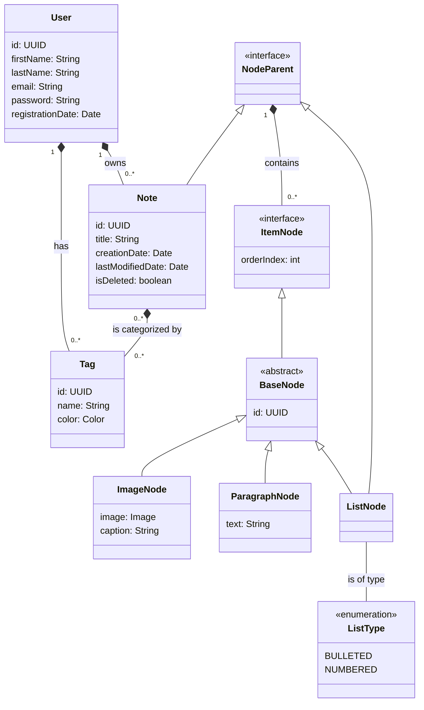

<!--
    Original template from:
    https://claude.ai/share/2539339f-ea2e-4429-893e-e851c1a7a76f
    [24/03/2025] Revised using template from:
    https://claude.ai/share/5289331f-ee0b-4e37-a5a6-641745b15808

    By: Jorge Arévalo
-->

