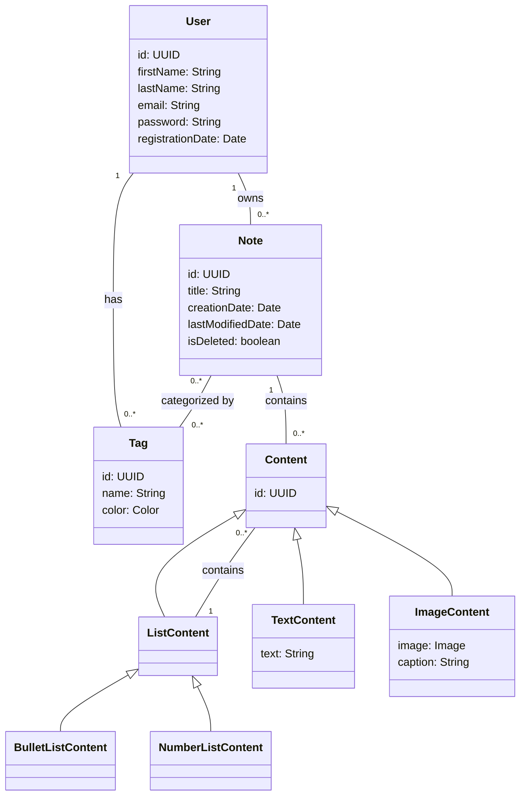

<!--
    Original template from:
    https://claude.ai/share/2539339f-ea2e-4429-893e-e851c1a7a76f

    By: Jorge Arévalo
-->

```mermaid
classDiagram
    User "1" -- "0..*" Note : owns
    User "1" -- "0..*" Tag : has
    Note "0..*" -- "0..*" Tag : categorized by
    Note "1" -- "0..*" Content : contains
    ListContent "1" -- "0..*" Content : contains

    Content <|-- TextContent
    Content <|-- ImageContent
    Content <|-- ListContent
    ListContent <|-- BulletListContent
    ListContent <|-- NumberListContent

    class User {
        id: UUID
        firstName: String
        lastName: String
        email: String
        password: String
        registrationDate: Date
    }

    class Note {
        id: UUID
        title: String
        creationDate: Date
        lastModifiedDate: Date
        isDeleted: boolean
    }

    class Tag {
        id: UUID
        name: String
        color: Color
    }

    class Content {
        id: UUID
    }

    class TextContent {
        text: String
    }

    class ImageContent {
        image: Image
        caption: String
    }
```